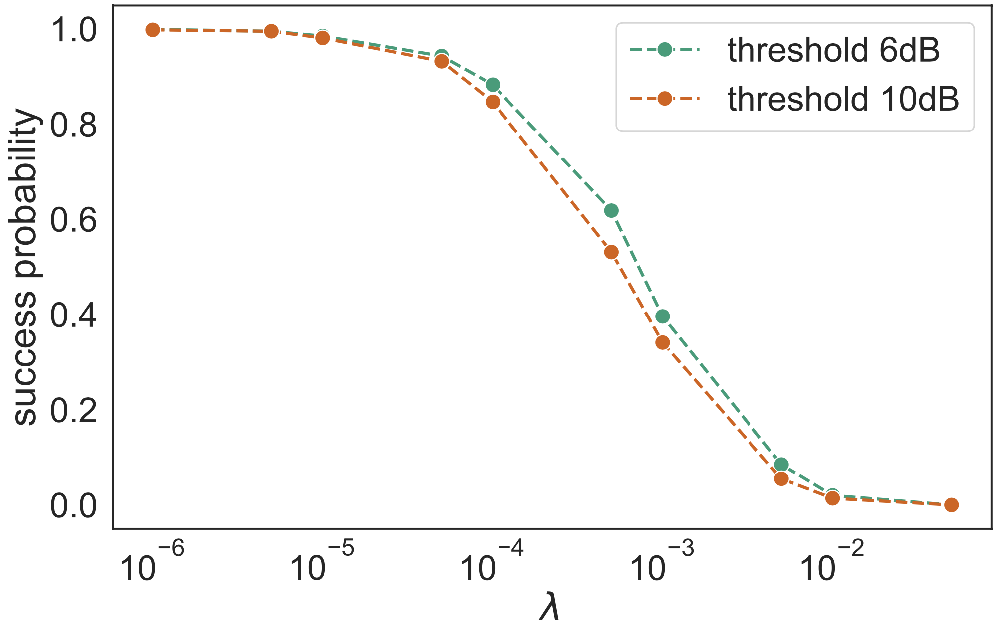
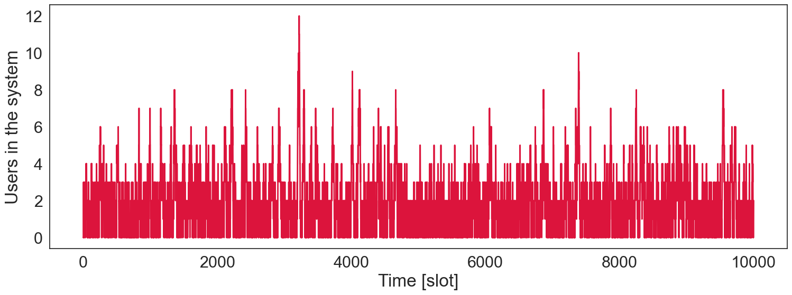
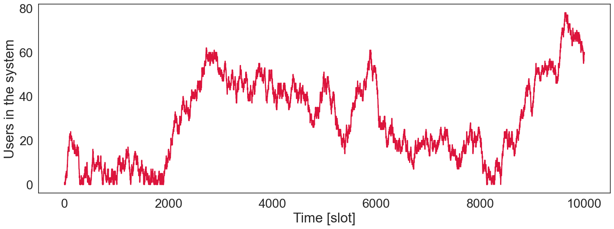
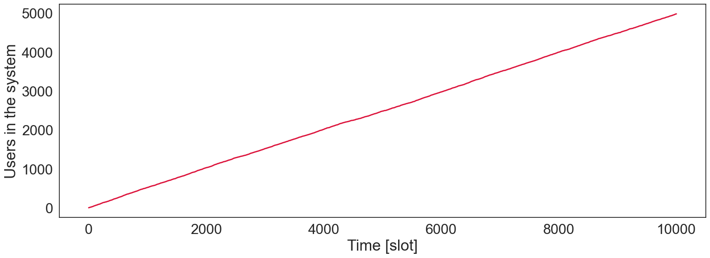
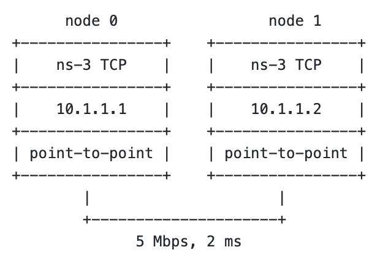
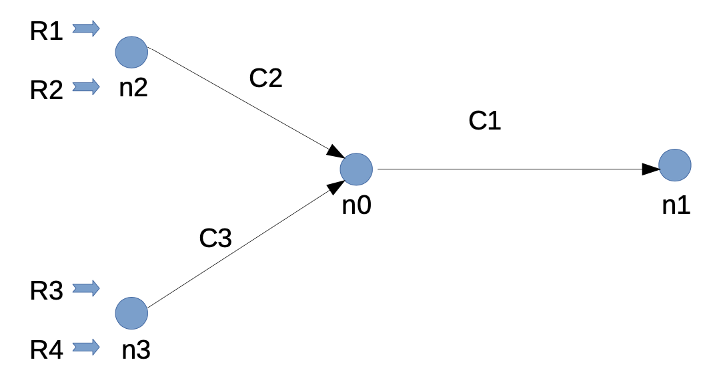

# Network Analysis and Simulation

This project is a collection of tools for network analysis and simulation, based on the course [Network Analysis and Simulation](https://didattica.unipd.it/off/2020/LM/IN/IN2371/002PD/INP9087850/N0).

The first part of the course is focus on providing basic statistical and analytical tools for simulation, while the second part is focused on the simulation of network by means of ns3. 

## Overview 
### Mathematical and analytical tools:
1. **Statistical analysis**: in [statistical_analysis](https://github.com/nicolezattarin/Network-Analysis-Simulation/tree/main/theoretical_tools/statistical_analysis) we explore the use of basic tools (e.g. confidence intervals, correlations, data visualization), testing both a data samples from a uniform and a normal distribution;

An example of analysis follows. Consider a sequence of 1000 data, each of which is composed by 48 elements uniformly distributed in [0, 1]. The following figure shows CI and corresponding sample mean, computed on of 48 items, compared with the true mean, represented by the 1000 datasets of 48 elements. The vertical dashed line vertical dashed line represents the real mean, and it shows how many times it falls into the computed CI.

  

2. **Random number generators**: in [RNG](https://github.com/nicolezattarin/Network-Analysis-Simulation/tree/main/theoretical_tools/RNG) we pèrovide a class for the generation of random numbers (uniform, exponential, geometric, binomial, poisson) and we explore the use and limitations of these generators;

  

### Simulation strategies
1. **Geographic Random Forwarding** (GeRaF) for Ad Hoc and Sensor Networks: Multihop Performance [1][2].

In [multihop_GeRaF](https://github.com/nicolezattarin/Network-Analysis-Simulation/tree/main/multihop_GeRaF)  section we present a simple implementation of the GeRaF algorithm for the simulation of Ad Hoc and Sensor networks. The algorithm is based on the [1] and [2]. The proposed idea is a forwarding technique based on geographical location of the nodes involved and random selection of the relaying node via contention among receivers. 
The figure below shows the performances of GeRaF compared with GAF [3]: 

  

  
2. **SINR systems**: in [SINR_systems](https://github.com/nicolezattarin/Network-Analysis-Simulation/tree/main/SINR_systems) we consider physical systems subjected to noise and interference, in particular we focus on the following scenarios:
 - Packet radio: a packet has to be delivered to an intended user, which is an an area characterized by a poisson distribution of interferes.
 - Cellular systems: an hexagonal cell is surrounded by cells of the same kind;
 - ALOHA: a multi access system in similar to the packet radio scenario, but in which every user can be potentially the intended or an interfere. 
We compute success and outage probabilities as function of the specific parameters of the system. Results are obtained with MC simulation and numerical integration with gaussian quadrature rules, in particular a possible outcome for the packet radio scenario follows:

  

3. **Single service queue**: in [single_server_queue](https://github.com/nicolezattarin/Network-Analysis-Simulation/tree/main/single_server_queue) we perform a discrete-time simulation of a single server queue with finite buffer size, under the assumption that arrivals cannot leave in the same slot in which they arrive. We consider the following situations:
  - P [1 arrival] = P [2 arrivals] = a, P [0 arrival] = 1 − 2a, a ∈ [0, 0.5], and single service time for each user;
  - P [1 arrival] = P [0 arrival] = 0.5 and geometric service time with mean probability b.
We can observe the behaviour of the queue state for different values of utilization factor, an example follows:

   
   

### NS3 Network simulation
In this section we present NS3 network simulations, mostly rearranged from [ns3 tutorial](https://www.nsnam.org/docs/tutorial/html/). In particular, each folder contains the code for the simulation, a file to run it and additional files to visualize the results. Note that these files are meant to be pasted in the scratch directory of ns3 and run from ns3 repository.

1. **2-nodes p2p UDP Echo Protocol**: in [udp_echo](https://github.com/nicolezattarin/Network-Analysis-Simulation/tree/main/udp_echo) we present a simple implementation (from ns3 tutorial) of the UDP Echo Protocol for the simulation of 2-nodes p2p networks. The network structure follows:

  

2. **Simple p2p-csma BUS protocol**: in [bus](https://github.com/nicolezattarin/Network-Analysis-Simulation/tree/main/bus) we present a simple implementation (from ns3 tutorial) of a bus with a 2p2 link and a variable number of csma, the network structure follows:

  

  
3. **2 Nodes TCP**: in [2nodes](https://github.com/nicolezattarin/Network-Analysis-Simulation/tree/main/TCP/2nodes) we perform the simulation of the following systema, to test callback functions and tracing:

  

  
4. **Overloaded TCP**: in [overloaded](https://github.com/nicolezattarin/Network-Analysis-Simulation/tree/main/TCP/overloaded) we provide the code to simulate and parse results for the following network:

  

**References:**

[1] M. Zorzi, R.R. Rao, “Geographic Random Forwarding (GeRaF) for ad hoc and sensor networks: multihop performance,” in IEEE Trans. on Mobile Computing, vol. 2, n. 4, Oct.-Dec. 2003.

[2] M. Zorzi, R.R. Rao, “Geographic Random Forwarding (GeRaF) for ad hoc and sensor networks: energy and latency performance,” in IEEE Trans. on Mobile Computing, vol. 2, n. 4, Oct.-Dec. 2003.

[3] Y. Xu, J. Heidemann, and D. Estrin, “Geography-Informed Energy Conservation for Ad Hoc Routing,” Proc. Seventh Ann. Int’l Conf. Mobile Computing and Networking, July 2001.
