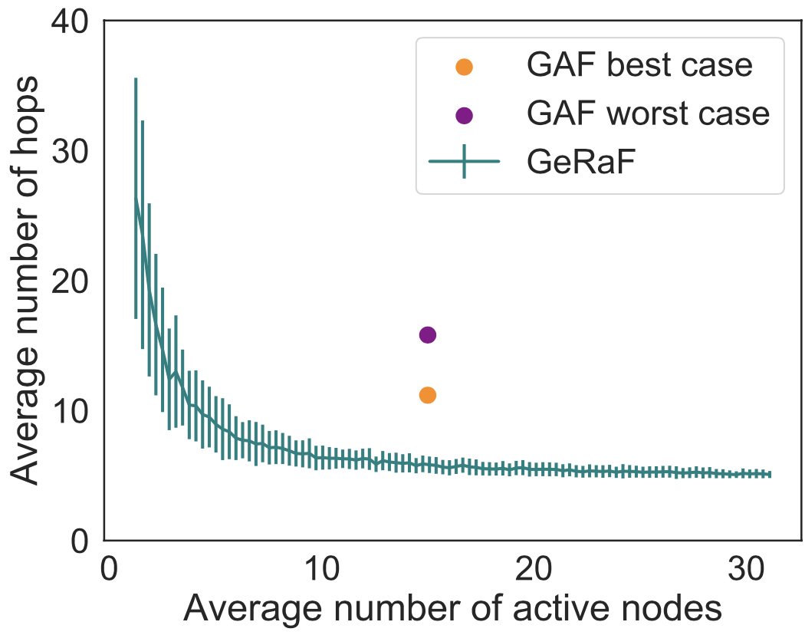

# Network Analysis and Simulation

This project is a collection of tools for network analysis and simulation, based on the course [Network Analysis and Simulation](https://didattica.unipd.it/off/2020/LM/IN/IN2371/002PD/INP9087850/N0).

The first part of the course is focus on providing basic statistical and analytical tools for simulation, while the second part is focused on the simulation of network by means of ns3. 

## Overview 
### Mathematical and analytical tools:
1. Statistical analysis: in [statistical_analysis](https://github.com/nicolezattarin/Network-Analysis-Simulation/tree/main/theoretical_tools/statistical_analysis) we explore the use of basic tools (e.g. confidence intervals, correlations, data visualization), testing both a data samples from a uniform and a normal distribution;

An example of analysis follows. Consider a sequence of 1000 data, each of which is composed by 48 elements uniformly distributed in [0, 1]. The following figure shows CI and corresponding sample mean, computed on of 48 items, compared with the true mean, represented by the 1000 datasets of 48 elements. The vertical dashed line vertical dashed line represents the real mean, and it shows how many times it falls into the computed CI.

  

2. Random number generators: in [RNG](https://github.com/nicolezattarin/Network-Analysis-Simulation/tree/main/theoretical_tools/RNG) we pèrovide a class for the generation of random numbers (uniform, exponential, geometric, binomial, poisson) and we explore the use and limitations of these generators;

  

### Simulation strategies
1. Geographic Random Forwarding (GeRaF) for Ad Hoc and Sensor Networks: Multihop Performance [1][2].

In [multihop_GeRaF](https://github.com/nicolezattarin/Network-Analysis-Simulation/tree/main/multihop_GeRaF)  section we present a simple implementation of the GeRaF algorithm for the simulation of Ad Hoc and Sensor networks. The algorithm is based on the [1] and [2]. The proposed idea is a forwarding technique based on geographical location of the nodes involved and random selection of the relaying node via contention among receivers. 
The figure below shows the performances of GeRaF compared with GAF [3]: 

  

**References:**

[1] M. Zorzi, R.R. Rao, “Geographic Random Forwarding (GeRaF) for ad hoc and sensor networks: multihop performance,” in IEEE Trans. on Mobile Computing, vol. 2, n. 4, Oct.-Dec. 2003.

[2] M. Zorzi, R.R. Rao, “Geographic Random Forwarding (GeRaF) for ad hoc and sensor networks: energy and latency performance,” in IEEE Trans. on Mobile Computing, vol. 2, n. 4, Oct.-Dec. 2003.

[3] Y. Xu, J. Heidemann, and D. Estrin, “Geography-Informed Energy Conservation for Ad Hoc Routing,” Proc. Seventh Ann. Int’l Conf. Mobile Computing and Networking, July 2001.
